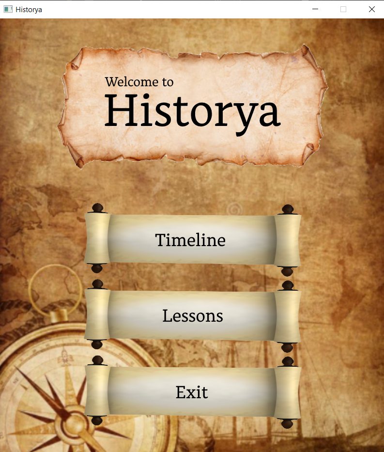

<h1 align = "center"> Team Historya </h1>

	

---

## 📝 Table of Contents

+ [About](#about)
+ [Team](#team)
+ [Technologies](#technologies)
+ [Installation](#installation)
+ [Function List](#function-list)

## 🤷‍♂️ About	<a name = "about"></a>
> Our project is an application that can be used for education and practice on historical events and their dates.


## 👨‍💻Team	<a name = "team"></a>
> 1. **MTIvanov19** - **Scrum trainer**	
   - ***GitHub profile***: [***MTIvanov19***](https://github.com/MTIvanov19)	

> 2. **KNTaligadzhiev19** - **Back-end Developer**	
   - ***GitHub profile***: [***KNTaligadzhiev19***](https://github.com/KNTaligadzhiev19)	

> 4. **GVIvanov19** - **Front-end Developer**		
   - ***GitHub profile***: [***GVIvanov19***](https://github.com/GVIvanov19)	

> 5. **PZSpasov19** - **Q&A engineer**		
   - ***GitHub profile***: [***PZSpasov19***](https://github.com/PZSpasov19)

 ## 💻 Technologies	<a name = "technologies"></a>
> The technologies we used for our project are Microsoft Teams for communication, Git and GitHub for code storage and teamwork on the code, Visual Studio for the code editor, Microsoft PowerPoint for preparing a presentation, Microsoft Word for preparing documentation.	

## ⌨ Installation	<a name = "installation"></a>

Paste this in cmd:	

````	
git clone https://github.com/KNTaligadzhiev19/historyProject-2022	
````

## 📃Function list <a name = "function-list"></a>

| Name  | Action  | Line |
| :------------ |:---------------:| -----:|